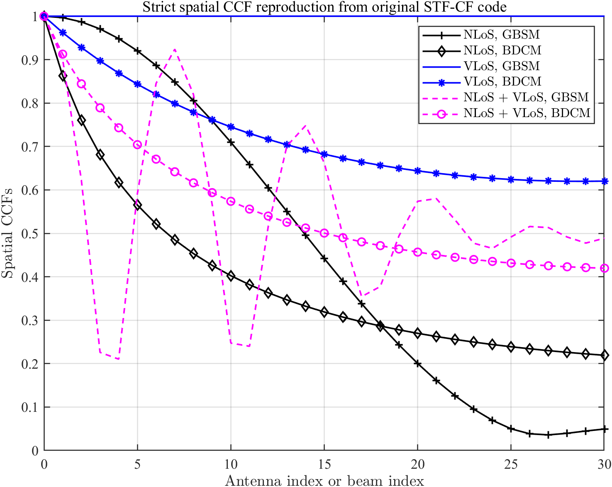
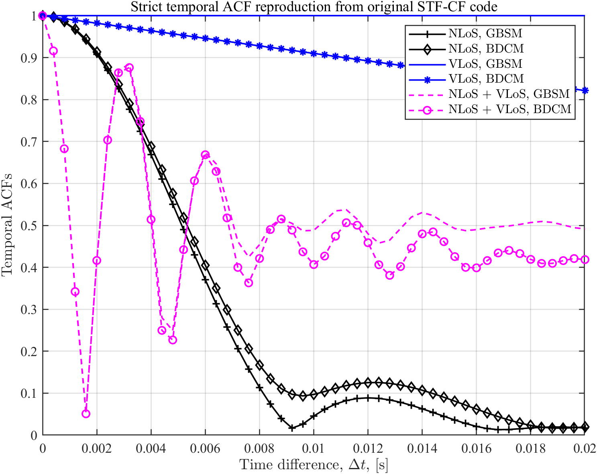
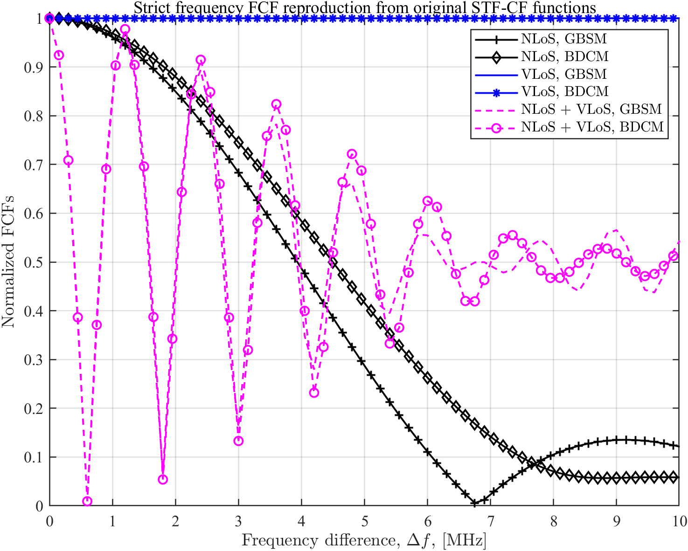
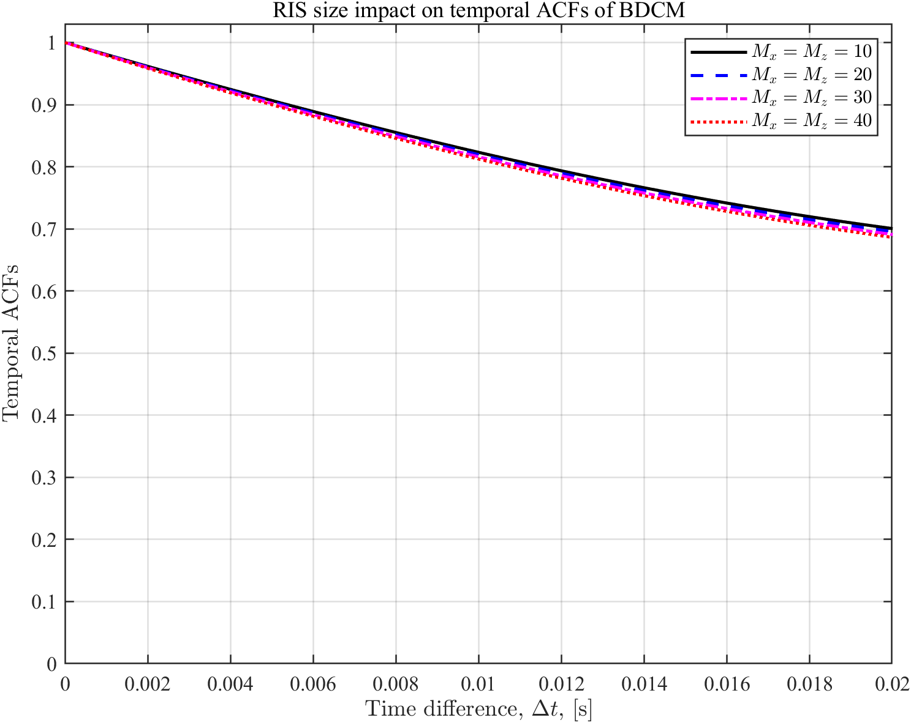
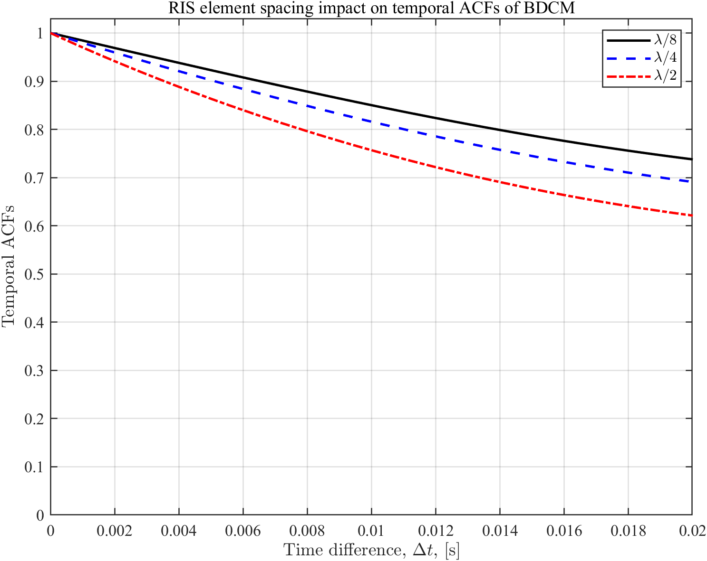
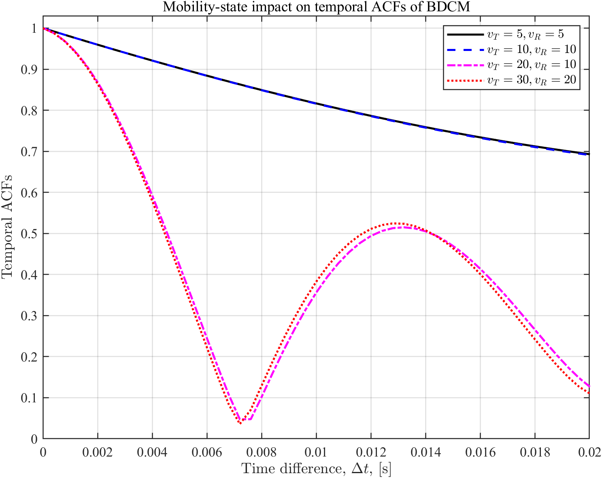

# RIS-V2V Beam-Domain Channel Modeling Simulator

MATLAB project for RIS-aided V2V three-dimensional dynamic channel modeling,
beam-domain statistical correlation reproduction, and mobility/RIS-parameter
extension experiments.

The project is organized around the paper:

> W. Shi et al., "RIS-Empowered V2V Communications: Three-Dimensional Beam
> Domain Channel Modeling and Analysis," IEEE Transactions on Wireless
> Communications, 2024.

## What This Project Does

- Refactors the original STF-CF MATLAB code into a reproducible project.
- Reproduces GBSM/BDCM statistical channel characteristics:
  - Spatial cross-correlation function (CCF)
  - Temporal auto-correlation function (ACF)
  - Frequency correlation function (FCF)
- Keeps the original link decomposition:
  - NLoS cluster link
  - RIS-assisted VLoS link
  - Rician-combined NLoS + VLoS link
- Adds extension experiments for RIS size, RIS element spacing, and mobility
  states.

## Project Structure

```text
.
|-- run_all.m
|-- run_reproduction.m
|-- run_extensions.m
|-- scripts/
|-- src/
|-- vendor/original_stf_cf/
|-- results/figures/
|-- results/data/
|-- docs/
|-- references/
```

`vendor/original_stf_cf/` contains the original STF-CF functions. The strict
reproduction scripts call those `rho_*` functions directly. The extension
experiments are kept separate and clearly marked as extensions.

## Quick Start

Run all reproduction and extension experiments:

```matlab
run_all
```

Run only strict reproduction:

```matlab
run_reproduction
```

Run only extension experiments:

```matlab
run_extensions
```

Outputs are saved to:

```text
results/figures/
results/data/
```

## Reproduction Results

### Spatial CCF



This experiment compares spatial CCFs of NLoS, VLoS, and Rician-combined links
under GBSM and BDCM descriptions.

### Temporal ACF



This experiment compares temporal ACFs and shows the non-stationary temporal
correlation behavior induced by V2V mobility and RIS-assisted propagation.

### Frequency FCF



This experiment compares normalized FCFs. The original `Frequency_FCF.m`
comments out BDCM plotting, but the BDCM helper functions are present, so this
project computes and saves the full six-curve comparison.

## Extension Results

### RIS Array Size



### RIS Element Spacing



### Mobility State



The extension experiments use the compact project model because the original
RIS `rho_*` functions hard-code `M_x = M_z = 30` internally. They are intended
to demonstrate additional analysis ability beyond strict reproduction.

## Documentation

- [Theory notes](docs/theory_notes.md)
- [Reproduction guide](docs/reproduction_guide.md)
- [Resume description](docs/resume_description.md)
- [Material notes](references/material_notes.md)

## MATLAB Environment

Tested locally with:

```text
matlab -batch "run_all"
```

No external MATLAB toolbox is required for the current scripts.

## Resume Summary

> Built a MATLAB simulator for RIS-aided V2V 3D dynamic channel modeling.
> Refactored original STF-CF code to reproduce GBSM/BDCM spatial CCF,
> temporal ACF, and frequency FCF results, and extended the study by analyzing
> RIS array size, element spacing, and mobility-state impacts on channel
> non-stationarity.

## License

MIT License. See [LICENSE](LICENSE).
